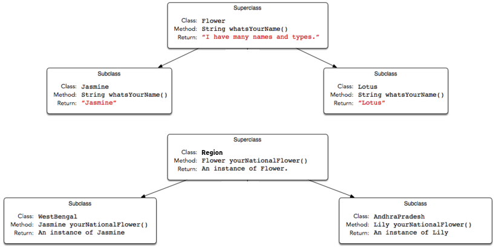

# [Covariant Return Types](https://www.hackerrank.com/challenges/java-covariance/problem)

**Difficulty:** easy
</br>**Points:** 20
</br>**Skill:** 

Java allows for [Covariant Return Types](https://docs.oracle.com/javase/tutorial/java/javaOO/returnvalue.html), which means you can vary your return type as long you are returning a subclass of your specified return type.

[Method Overriding](https://docs.oracle.com/javase/tutorial/java/IandI/override.html) allows a subclass to override the behavior of an existing superclass method and specify a return type that is some subclass of the original return type. 
It is best practice to use the _@Override_ [annotation](https://docs.oracle.com/javase/tutorial/java/annotations/basics.html) when overriding a superclass method.

Implement the classes and methods detailed in the diagram below:


You will be given a partially completed code in the editor where the main method takes the name of a state (i.e., _WestBengal_, or _AndhraPradesh_) and prints the national flower of that state using the classes and methods written by you.

**Note**: Do not use access modifiers in your class declarations.

## Resources
[Covariant Return Type](http://c2.com/cgi/wiki?CovariantReturnTypes)</br>
[Java Covariant Type](https://blogs.oracle.com/sundararajan/entry/covariant_return_types_in_java)

## Input Format

The locked code reads a single string denoting the name of a subclass of State (i.e., _WestBengal_, _Karnataka_, or _AndhraPradesh_), then tests the methods associated with that subclass. You are not responsible for reading any input from stdin.

## Output Format

Output is handled for you by the locked code, which creates the object corresponding to the input string's class name and then prints the name returned by that class' national flower's whatsYourName method. You are not responsible for printing anything to stdout.

## Sample Input 0
````java
AndhraPradesh
````

## Sample Output 0
````java
Lily
````

## Explanation 0

An AndhraPradesh object's yourNationalFlower method returns an instance of the Lily class, and the Lily class' whatsYourName method returns _Lily_, which is printed by the hidden code checker.