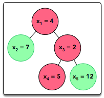

# [Java Visitor Pattern](https://www.hackerrank.com/challenges/java-vistor-pattern/problem)

**Difficulty:** medium
</br>**Points:** 40
</br>**Skill:** 

**Note**: In this problem you **must NOT** generate any output on your own. Any such solution will be considered as being against the rules and its author will be disqualified. The output of your solution must be generated by the uneditable code provided for you in the solution template.

An important concept in Object-Oriented Programming is the [open/closed principle](https://en.wikipedia.org/wiki/Open/closed_principle), which means writing code that is open to extension but closed to modification. In other words, new functionality should be added by writing an extension for the existing code rather than modifying it and potentially breaking other code that uses it. This challenge simulates a real-life problem where the open/closed principle can and should be applied.

A Tree class implementing a rooted tree is provided in the editor. It has the following publicly available methods:
- **getValue()**: Returns the value stored in the node.
- **getColor()**: Returns the color of the node.
- **getDepth()**: Returns the [depth](https://en.wikipedia.org/wiki/Tree_%28data_structure%29#Terminologies_used_in_Trees) of the node. Recall that the depth of a node is the number of edges between the node and the tree's root, so the tree's root has depth _0_ and each descendant node's depth is equal to the depth of its parent node _1_.
In this challenge, we treat the internal implementation of the tree as being closed to modification, so we cannot directly modify it; however, as with real-world situations, the implementation is written in such a way that it allows external classes to extend and build upon its functionality. More specifically, it allows objects of the TreeVis class (a [Visitor Design Pattern](https://en.wikipedia.org/wiki/Visitor_pattern)) to visit the tree and traverse the tree structure via the _accept_ method.

There are two parts to this challenge.

## Part I: Implement Three Different Visitors
Each class has three methods you must write implementations for:
1. **getResult():** Return an integer denoting the , which is different for each class:
   - The SumInLeavesVisitor implementation must return the sum of the values in the tree's leaves only.
   - The ProductRedNodesVisitor implementation must return the product of values stored in all red nodes, including leaves, computed modulo _10<sup>9</sup>+7_. Note that the product of zero values is equal to _1_.
   - The FancyVisitor implementation must return the absolute difference between the sum of values stored in the tree's non-leaf nodes at even depth and the sum of values stored in the tree's green leaf nodes. Recall that zero is an [even number](https://en.wikipedia.org/wiki/Parity_of_zero).

2. **visitNode(TreeNode node):** Implement the logic responsible for visiting the tree's non-leaf nodes such that the getResult method returns the correct _result_ for the implementing class' visitor.

3. **visitLeaf(TreeLeaf leaf):** Implement the logic responsible for visiting the tree's leaf nodes such that the getResult method returns the correct _result_ for the implementing class' visitor.

## Part II: Read and Build the Tree
Read the _n_-node tree, where each node is numbered from _1_ to _n_. The tree is given as a list of node values (_x<sub>1</sub>, x<sub>2</sub>, ..., x<sub>n</sub>_), a list of node colors (_c<sub>1</sub>, c<sub>2</sub>, ..., c<sub>n</sub>_), and a list of edges. Construct this tree as an instance of the Tree class. The tree is always rooted at node number _1_.

Your implementations of the three visitor classes will be tested on the tree you built from the given input.

## Input Format

The first line contains a single integer, _n_, denoting the number of nodes in the tree. The second line contains _n_ space-separated integers describing the respective values of _x<sub>1</sub>, x<sub>2</sub>, ..., x<sub>n</sub>_.

The third line contains _n_ space-separated binary integers describing the respective values of _c<sub>1</sub>, c<sub>2</sub>, ..., c<sub>n</sub>_. Each _c<sub>i</sub>_ denotes the color of the _i<sup>th</sup>_ node, where _0_ denotes red and _1_ denotes green.

Each of the _n-1_ subsequent lines contains two space-separated integers, _u<sub>i</sub>_ and _v<sub>i</sub>_, describing an edge between nodes _u<sub>i</sub>_ and _v<sub>i</sub>_.

## Constraints
- 2 <= n <= 10<sup>5</sup>
- 1 <= x<sub>i</sub> <= 10<sup>3</sup>
- c<sub>i</sub> ∈ {0,1}
- 1 <= v<sub>i</sub>, v<sub>i</sub> <= n
- It is guaranteed that the tree is rooted at node .

## Output Format

Do not print anything to stdout, as this is handled by locked stub code in the editor. The three _getResult()_ methods provided for you must return an integer denoting the _result_ for that class' visitor (defined above). Note that the value returned by ProductRedNodesVisitor's getResult method must be computed modulo _10<sup>9</sup> + 7_.

## Sample Input
````java
5
4 7 2 5 12
0 1 0 0 1
1 2
1 3
3 4
3 5
````

## Sample Output
````java
24
40
15
````

## Explanation

image

Locked stub code in the editor tests your three class implementations as follows:
1. Creates a SumInLeavesVisitor object whose getResult method returns the sum of the leaves in the tree, which is _7+5+12=24_. The locked stub code prints the returned value on a new line.
2. Creates a ProductOfRedNodesVisitor object whose getResult method returns the product of the red nodes, which is _4*2*5=40_. The locked stub code prints the returned value on a new line.
3. Creates a FancyVisitor object whose getResult method returns the absolute difference between the sum of the values of non-leaf nodes at even depth and the sum of the values of green leaf nodes, which is _|4-(7+12)|=15_. The locked stub code prints the returned value on a new line.