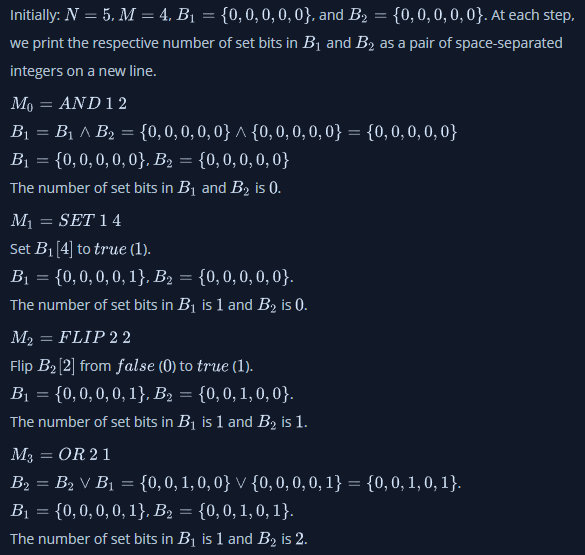

# [Java BitSet](https://www.hackerrank.com/challenges/java-bitset/problem)

**Difficulty:** easy
</br>**Points:** 20
</br>**Skill:** Java (Basic)

Java's BitSet class implements a vector of bit values (i.e.: _false_ (0) or _true_ (1)) that grows as needed, allowing us to easily manipulate bits while optimizing space (when compared to other collections). 
Any element having a bit value of _1_ is called a set bit.

Given _2_ BitSets, _B<sub>1</sub>_ and _B<sub>2</sub>_, of size _N_ where all bits in both BitSets are initialized to _0_, perform a series of _M_ operations. 
After each operation, print the number of set bits in the respective BitSets as two space-separated integers on a new line.

## Input Format

The first line contains _2_ space-separated integers, _N_ (the length of both BitSets _B<sub>1</sub>_ and _B<sub>2</sub>_) and _M_ (the number of operations to perform), respectively.</br>
The _M_ subsequent lines each contain an operation in one of the following forms:
- AND \<set> \<set>
- OR \<set> \<set>
- XOR \<set> \<set>
- FLIP \<set> \<index>
- SET \<set> \<index>
 
In the list above, _\<set>_ is the integer _1_ or _2_, where _1_ denotes _B<sub>1</sub>_ and _2_ denotes _B<sub>2</sub>_.
_\<index>_ is an integer denoting a bit's index in the BitSet corresponding to _\<set>_.

For the binary operations _AND_, _OR_, and _XOR_, operands are read from left to right and the BitSet resulting from the operation replaces the contents of the first operand. For example:
````java
AND 2 1
````

_B<sub>2</sub>_ is the left operand, and _B<sub>1</sub>_ is the right operand. This operation should assign the result of _B<sub>2</sub> ⋀ B<sub>1</sub>_ to _B<sub>2</sub>_.

## Constraints
- 1 <= N <= 1000
- 1 <= M <= 10000

## Output Format

After each operation, print the respective number of set bits in BitSet _B<sub>1</sub>_ and BitSet _B<sub>2</sub>_ as _2_ space-separated integers on a new line.

## Sample Input
````java
5 4
AND 1 2
SET 1 4
FLIP 2 2
OR 2 1
````

## Sample Output
````java
0 0
1 0
1 1
1 2
````

## Explanation
