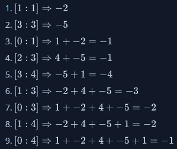

# [Java Subarray](https://www.hackerrank.com/challenges/java-negative-subarray/problem)

**Difficulty:** easy
</br>**Points:** 10
</br>**Skill:** Java (Basic)

We define the following:
- A subarray of an _n_-element array is an array composed from a contiguous block of the original array's elements. For example, if _array = [1, 2, 3]_, then the subarrays are [1], [2], [3], [1,2], [2,3] and [1,2,3]. Something like [1,3] would not be a subarray as it's not a contiguous subsection of the original array.
- The sum of an array is the total sum of its elements.
  - An array's sum is negative if the total sum of its elements is negative.
  - An array's sum is positive if the total sum of its elements is positive.

Given an array of _n_ integers, find and print its number of negative subarrays on a new line.

## Input Format

The first line contains a single integer, _n_, denoting the length of array _A = [a<sub>0</sub>, a<sub>1</sub>, ..., a<sub>n-1</sub>]_.

The second line contains _n_ space-separated integers describing each respective element, _a<sub>i</sub>_, in array _A_.

## Constraints
- _1 <= n <= 100_
- _-10<sup>4</sup> <= a<sub>i</sub> <= 10<sup>4</sup>_

## Output Format

Print the number of subarrays of _A_ having negative sums.

## Sample Input
````java
5
1 -2 4 -5 1
````

## Sample Output
````java
9
````

## Explanation

There are nine negative subarrays of _A = [1, -2, 4, -5, 1]_:



Thus, we print _9_ on a new line.