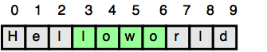

# [Java Substring](https://www.hackerrank.com/challenges/java-substring/problem)

**Difficulty:** easy
</br>**Points:** 5
</br>**Skill:** Java (Basic)

Given a string, _s_, and two indices, _start_ and _end_, print a substring consisting of all characters in the inclusive range from _start_ to _end-1_. You'll find the String class' substring method helpful in completing this challenge.

## Input Format

The first line contains a single string denoting _s_.
The second line contains two space-separated integers denoting the respective values of _start_ and _end_.

## Constraints
1 <= |s| <= 100</br>
0 <= start < end <= n</br>
String  consists of English alphabetic letters (i.e.,_[a-zA-Z]_ ) only.

## Output Format

Print the substring in the inclusive range from _start_ to _end-1_.

## Sample Input
````java
Helloworld
3 7
````

## Sample Output
````java
lowo
````

## Explanation

In the diagram below, the substring is highlighted in green:

