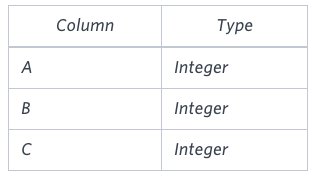
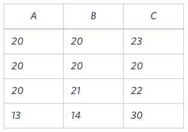

# [Type of Triangle](https://www.hackerrank.com/challenges/what-type-of-triangle/problem)

**Difficulty:** easy
</br>**Points:** 20
</br>**Skill:** SQL (Basic)

# Problem
Write a query identifying the type of each record in the **TRIANGLES** table using its three side lengths. Output one of the following statements for each record in the table:

- **Equilateral**: It's a triangle with _3_ sides of equal length.
- **Isosceles**: It's a triangle with _2_ sides of equal length.
- **Scalene**: It's a triangle with _3_ sides of differing lengths.
- **Not A Triangle**: The given values of A, B, and C don't form a triangle.

## Input Format

The **TRIANGLES** table is described as follows:



Each row in the table denotes the lengths of each of a triangle's three sides.

## Sample Input


## Sample Output
````mysql
Isosceles
Equilateral
Scalene
Not A Triangle
````

## Explanation

Values in the tuple _(20, 20, 23)_ form an Isosceles triangle, because _A ≡ B_.</br>
Values in the tuple _(20, 20, 20)_ form an Equilateral triangle, because _A ≡ B ≡ C_. </br> 
Values in the tuple _(20, 21, 22)_ form a Scalene triangle, because _A ≠ B ≠ C_.</br>
Values in the tuple _(13, 14, 30)_ cannot form a triangle because the combined value of sides _A_ and _B_ is not larger than that of side _C_.

# Solution
```mysql
SELECT 
    CASE WHEN A+B<=C 
        THEN  'Not A Triangle' 
        ELSE 
            CASE WHEN A=B AND B=C
                THEN 'Equilateral'
                ELSE 
                    CASE WHEN A=B OR B=C OR A=C
                        THEN 'Isosceles'
                        ELSE 'Scalene'
    END END END
    as Result
FROM Triangles;
```