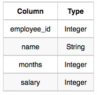
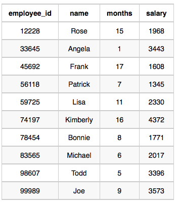

# [Employee Names](https://www.hackerrank.com/challenges/name-of-employees/problem)

**Difficulty:** easy
</br>**Points:** 10
</br>**Skill:** SQL (Basic)

# Problem
Write a query that prints a list of employee names (i.e.: the name attribute) from the **Employee** table in alphabetical order.

## Input Format

The **Employee** table containing employee data for a company is described as follows: 



where employee_id is an employee's ID number, name is their name, months is the total number of months they've been working for the company, and salary is their monthly salary.

## Sample Input


## Sample Output
````mysql
Angela
Bonnie
Frank
Joe
Kimberly
Lisa
Michael
Patrick
Rose
Todd
````

# Solution
````mysql
SELECT name
FROM Employee
ORDER BY name;
````
