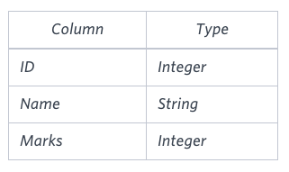
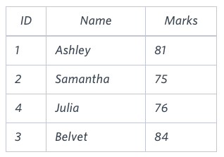

# [Higher Than 75 Marks](https://www.hackerrank.com/challenges/more-than-75-marks/problem)

**Difficulty:** easy
</br>**Points:** 15
</br>**Skill:** SQL (Basic)

# Problem
Query the Name of any student in **STUDENTS** who scored higher than _75_ Marks.
Order your output by the last three characters of each name. If two or more students both have names ending in the same last three characters (i.e.: Bobby, Robby, etc.), secondary sort them by ascending ID.

## Input Format

The **STUDENTS** table is described as follows: 


The Name column only contains uppercase (A-Z) and lowercase (a-z) letters.

## Sample Input


## Sample Output
````mysql

````

## Explanation

Only Ashley, Julia, and Belvet have Marks > _75_. If you look at the last three characters of each of their names, there are no duplicates and 'ley' < 'lia' < 'vet'. 

# Solution
````mysql
SELECT Name
FROM Students
WHERE Marks > 75
ORDER BY RIGHT(Name,3), Id;
````