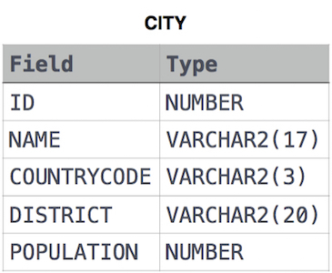

# [Select By ID](https://www.hackerrank.com/challenges/select-by-id/problem)

**Difficulty:** easy
</br>**Points:** 10
</br>**Skill:** SQL (Basic)

# Problem
Query all columns for a city in **CITY** with the ID _1661_.

The **CITY** table is described as follows: 



# Solution
````mysql
SELECT *
FROM City
WHERE ID = 1661;
````